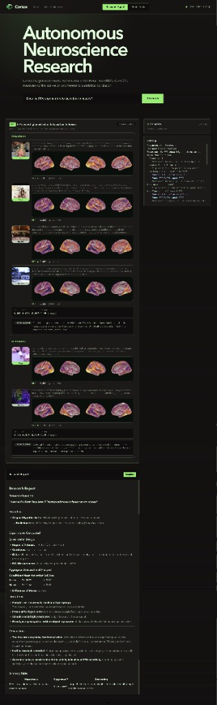
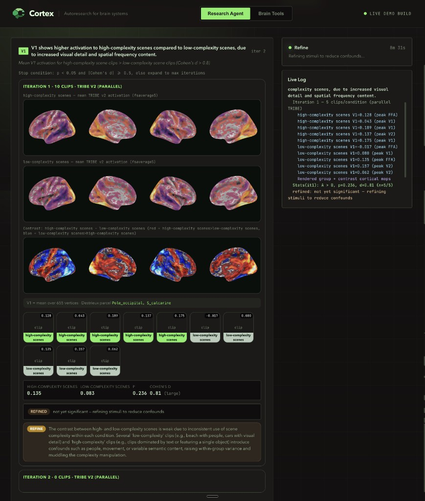

# Cortex

<p align="center">
  
</p>

Cortex is an autonomous neuroscience research agent that can design experiments, generate stimuli, run brain tools, and revise hypotheses from real evidence.

It also ships as an MCP server, so other agents can call the same neuroscience tools directly from Cursor, Claude Code, Codex, or any MCP-compatible client.

Built at the Autoresearch Systems Hackathon on May 30, 2026 with Modal, OpenAI, Raindrop, and Antler.

<p align="center">
  
</p>

## Why Cortex

Most research agents can search papers and write summaries. Cortex adds a brain-data loop:

1. Turn a question into falsifiable neuroscience hypotheses.
2. Generate controlled stimuli for the experiment.
3. Predict or analyze brain activation with specialized tools.
4. Cross-check against literature and meta-analysis.
5. Keep, refine, or discard each hypothesis.
6. Produce a structured research report with limitations.

## Main Features

- **MCP brain tools:** Exposes fMRI prediction, literature search, ALE meta-analysis, coordinate decoding, EEG analysis, and stimulus generation through FastMCP.
- **Autonomous research loop:** Uses the OpenAI Agents SDK to decompose questions, run experiments, interpret results, and iterate.
- **Live demo UI:** Streams experiment design, generated stimuli, TRIBE results, statistics, decisions, and final report into a React dashboard.
- **GPU brain inference:** Runs TRIBE v2 jobs through Modal for cortical activation maps.
- **Traceable research quality:** Integrates with Raindrop Workshop signals for hypothesis quality, tool selection, overinterpretation, and loop stalls.

## Installation

Cortex requires Python 3.12 or higher.

```bash
git clone https://github.com/sissississi-013/cortex.git
cd cortex

python3.12 -m venv .venv
source .venv/bin/activate
pip install -r requirements.txt
```

For the web dashboard:

```bash
cd web
npm install
```

## Quickstart

Run the local brain tools test. This does not require an OpenAI key.

```bash
python -m cortex test-tools
```

Run the MCP server for other agents:

```bash
python -m cortex server
```

Or run it over HTTP:

```bash
python -m cortex server --http 8742
```

Run the autonomous researcher:

```bash
export OPENAI_API_KEY=sk-...
python -m cortex research "How does the brain process speech vs music?"
```

## Web Demo

Start the API server:

```bash
uvicorn cortex.api:app --reload --port 8000
```

Start the frontend:

```bash
cd web
npm run dev
```

Open the Vite URL and ask a falsifiable neuroscience question, for example:

```text
Does the fusiform face area respond more to faces than houses?
```

The dashboard shows the full workflow: experiment design, generated stimuli, cortical maps, live logs, statistical decisions, and final report.

<p align="center">
  
</p>

## MCP Tools

| Tool | Purpose | Backend |
| --- | --- | --- |
| `predict_fmri` | Predict cortical activation for a stimulus | TRIBE v2 on Modal |
| `search_literature` | Search neuroimaging studies | NiMARE and Neurosynth |
| `meta_analyze` | Run ALE coordinate meta-analysis | NiMARE |
| `decode_brain_region` | Decode cognitive functions from MNI coordinates | Neurosynth reverse inference |
| `analyze_eeg` | Analyze ERP, time-frequency, or source localization | MNE-Python |
| `generate_image` | Create controlled visual stimuli | OpenAI image generation |
| `generate_audio` | Create auditory stimuli | OpenAI text-to-speech |
| `generate_text` | Create reading stimuli | OpenAI text generation |
| `generate_stimulus_pair` | Create matched A/B experiment stimuli | Cortex stimulus generator |

## Connect From Cursor Or Claude Code

Add Cortex to your MCP config:

```json
{
  "cortex-brain-tools": {
    "command": "python",
    "args": ["-m", "cortex.mcp_server"],
    "cwd": "/path/to/cortex"
  }
}
```

Then ask your agent to use the Cortex tools for neuroscience questions, experiment design, or brain-region interpretation.

## Raindrop Workshop

Cortex includes custom signals for monitoring research quality:

- `hypothesis_unfalsifiable` catches vague or untestable hypotheses.
- `tool_selection_mismatch` detects when the wrong brain tool is selected.
- `result_overinterpretation` flags claims that go beyond the evidence.
- `hypothesis_loop_stall` detects repeated refinement without progress.

Run with Raindrop Workshop:

```bash
export RAINDROP_WRITE_KEY=rk_...
export RAINDROP_LOCAL_DEBUGGER=http://localhost:5899/v1/
python -m cortex demo
```

Open Raindrop Workshop to inspect the hypothesis-test-revise trace.

## Project Structure

```text
cortex/
  cortex/
    api.py                 # FastAPI server for the web demo
    mcp_server.py          # FastMCP brain tools server
    agent.py               # OpenAI Agents SDK orchestrator
    research_loop.py       # Streaming hypothesis-test-revise loop
    modal_app.py           # Modal GPU functions for TRIBE v2
    tools/
      stimulus_gen.py      # Image, audio, text, and paired stimulus generation
      tribe_fmri.py        # fMRI prediction interface
      nimare_literature.py # Literature search, meta-analysis, decoding
      mne_eeg.py           # EEG analysis
  web/
    src/                   # React dashboard
  assets/                  # README visuals
```

## License

MIT
